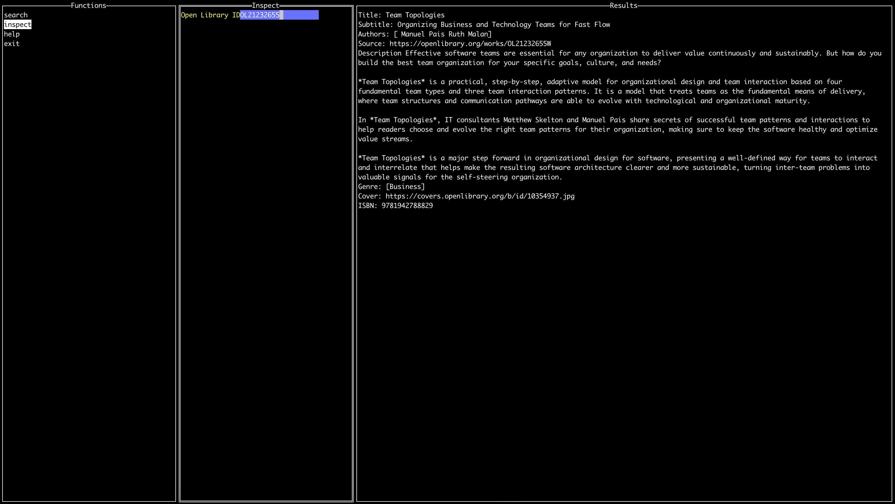

# Bookworm

A TUI app to quickly search for books and add them to my "to read" list

Ultimate goal is send a title of a book to the api, and have it add it to my website. But that will require setting up microformats.

## Examples

Start with the open library api.

start with the latest recommendations
- How to Measure Anything: Finding the Value of "Intangibles" in Business (Douglas  Hubbard)
- Supercommunicators: How to Unlock the Secret Language of Connection (Charlest Dugg)

## Rules of Side Questing 

As with most side quests, this project is more about the journey more than the destination.

Want to learn: 
- more go
- more of go std lib
- architecture design patterns
- consequences of actually having an application more than 2000 lines of code
- experiment with TUIs
- continue to improve speed with neovim

Offlimits:
- frameworks and libraries that solve problems in this domain out of the box
  - cobra commands
  - gin
  - bubbletea

